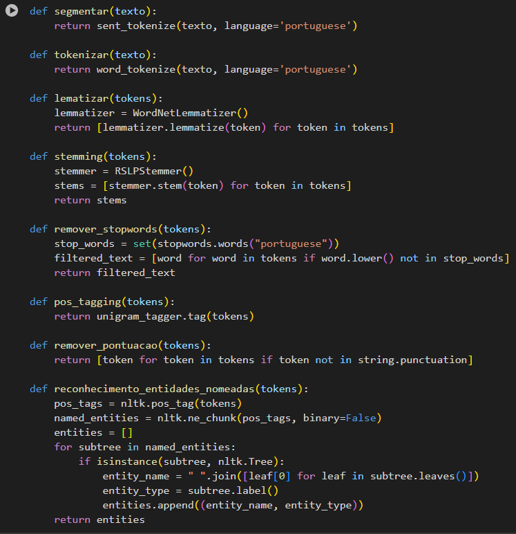
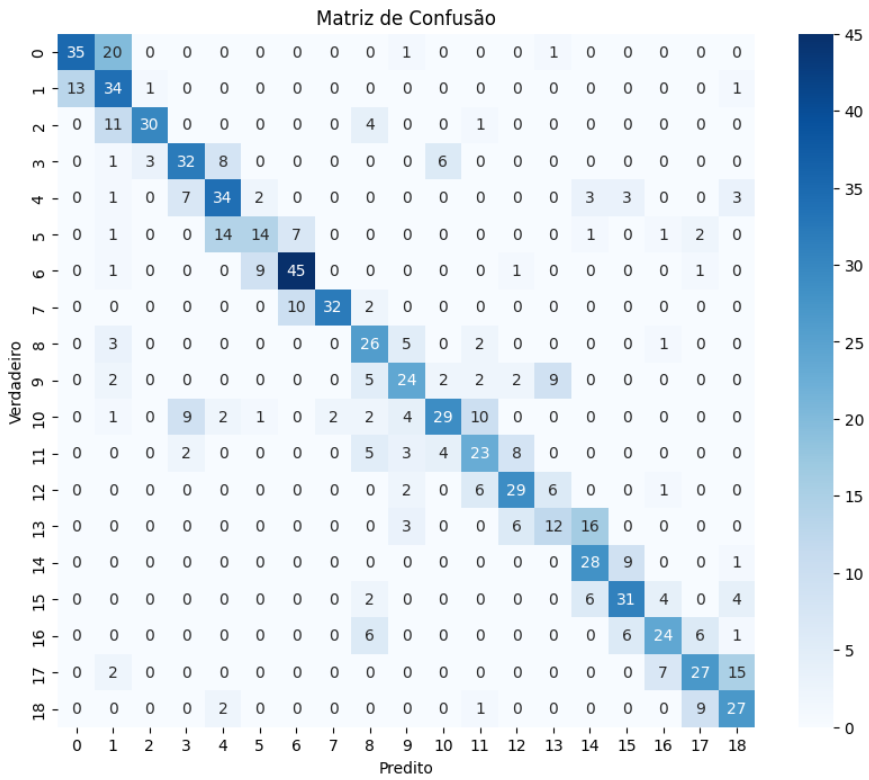
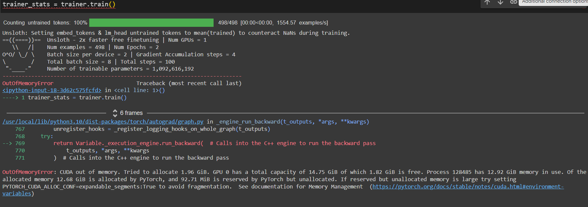

# Introdução

A crescente demanda por serviços de atendimento ao cliente (SAC) tem imposto desafios significativos às empresas na manutenção de um alto nível de qualidade no suporte oferecido, especialmente em ambientes multiculturais e multilíngues, como o da Brastel. Atualmente, o SAC da Brastel opera em diversos idiomas e realiza mais de 25 mil atendimentos mensais via chat online, o que sobrecarrega a capacidade de resposta dos atendentes humanos. Esse cenário é comum em muitas organizações, evidenciando a necessidade urgente de soluções inovadoras que garantam tanto a satisfação contínua dos clientes quanto a eficiência operacional. Um exemplo notável é o estudo da Sephora (DANG, 2022), que adotou chatbots para gerenciar o aumento no volume de interações com clientes, resultando em um ganho expressivo na eficiência operacional.

Diante desses desafios, a implementação de soluções baseadas em inteligência artificial, como chatbots, apresenta-se como uma estratégia promissora para melhorar a eficiência operacional e a qualidade do atendimento ao cliente. Estudos indicam que o uso de IA em atendimento ao cliente pode não apenas aumentar a satisfação dos clientes, mas também oferecer insights valiosos para a melhoria contínua dos serviços, contribuindo para o crescimento sustentável das empresas (DAVENPORT; RONANKI, 2018).

A escolha por um chatbot de IA generativa está fortemente fundamentada no seu potencial de personalização e na capacidade de aprendizado contínuo, características essenciais para atender às necessidades específicas dos clientes da Brastel. Além disso, a utilização de modelos abertos, como o LLaMA2, ajustados com dados específicos do domínio do problema, assegura que a solução seja altamente adaptada ao contexto de uso. Estudos indicam que a personalização proporcionada por sistemas de IA pode resultar em interações mais precisas e relevantes para os clientes, aumentando a eficiência e a satisfação (HUANG; RUST, 2021).

Além de melhorar o atendimento direto ao cliente, a adoção de um chatbot de IA generativa pode gerar insights valiosos a partir das interações, permitindo à Brastel identificar padrões e tendências no comportamento dos usuários. Essas informações podem ser utilizadas para aperfeiçoar os produtos e serviços oferecidos, bem como para antecipar as necessidades dos clientes, criando uma vantagem competitiva no mercado. Dessa forma, o chatbot não só responde às demandas atuais, mas também se torna uma ferramenta estratégica para o crescimento e inovação contínuos da empresa.

Diante desses desafios, a implementação de soluções baseadas em inteligência artificial, como chatbots, apresenta-se como uma estratégia promissora para melhorar a eficiência operacional e a qualidade do atendimento ao cliente. Estudos recentes destacam que chatbots têm um impacto significativo na qualidade do serviço, proporcionando interações mais rápidas e personalizadas, o que pode elevar a satisfação do cliente e contribuir para o crescimento sustentável das empresas (MISISCHIA; POECZE; STRAUSS, 2022)."

# Trabalhos Relacionados

Diversos estudos têm explorado a integração de inteligência artificial (IA) em serviços de atendimento ao cliente, destacando tanto os benefícios quanto os desafios envolvidos. Esta seção analisa os trabalhos mais relevantes sobre o tema, baseando-se em uma revisão da literatura realizada em bases de dados de alto impacto, incluindo Google Scholar, IEEE Xplore, Scopus e ScienceDirect. As palavras-chave utilizadas nas pesquisas incluem "Chatbots in Customer Service", "Artificial Intelligence in Customer Support", "Impact of AI in Customer Interaction", "Personalization in AI-driven Customer Service" e "AI in Multilingual Customer Service".

ADAMOPOULOU e MOUSSIADES (2020) oferecem uma visão abrangente sobre a tecnologia de chatbots, destacando seu papel na automação de interações e na melhoria da eficiência operacional. Os autores exploram a evolução dos chatbots e sua aplicação em diferentes setores, especialmente em ambientes com grande volume de interações. O estudo fornece uma análise detalhada das tecnologias subjacentes aos chatbots, incluindo uma discussão sobre os benefícios operacionais, como a redução de custos e o aumento da eficiência. No entanto, o foco do trabalho é predominantemente teórico, com pouca análise empírica dos resultados práticos de implementação, o que limita sua aplicação prática imediata.

Em um estudo relacionado, DAVENPORT e RONANKI (2018) discutem o potencial transformador da IA no atendimento ao cliente, com ênfase na capacidade da tecnologia de fornecer respostas rápidas e personalizadas. Este trabalho é especialmente relevante para empresas que operam em múltiplos idiomas, pois destaca como a IA pode melhorar a experiência do cliente ao adaptar o suporte ao contexto cultural. Um ponto positivo significativo é a clareza com que os autores abordam a importância da personalização nas interações com os clientes, oferecendo insights valiosos para empresas globais que necessitam de suporte multilíngue. Entretanto, a pesquisa não explora em profundidade os desafios técnicos relacionados à implementação de IA em larga escala, o que poderia enriquecer ainda mais a discussão.

HUANG e RUST (2021) propõem um framework inovador para entender o impacto da IA no marketing e no atendimento ao cliente, enfatizando a importância da personalização nas interações. O estudo destaca como a IA, através de seu aprendizado contínuo, pode proporcionar interações mais relevantes e satisfatórias, um aspecto crítico para o desenvolvimento de chatbots avançados. Este framework oferece uma nova perspectiva que pode ser aplicada em diversos contextos, enfatizando a capacidade de aprendizado contínuo da IA, essencial para a melhoria constante dos serviços. No entanto, a aplicação prática do framework proposto não é explorada detalhadamente, deixando em aberto como ele pode ser implementado em situações reais, o que representa uma lacuna na pesquisa.

Por fim, MISISCHIA, POECZE e STRAUSS (2022) conduziram um estudo que analisa a relevância dos chatbots no atendimento ao cliente, com foco no impacto que essa tecnologia pode ter na qualidade do serviço prestado. Os autores sugerem que a adaptação dos chatbots ao domínio específico do problema é fundamental para garantir que o suporte oferecido seja eficaz e esteja alinhado com as expectativas dos clientes. Este estudo é valioso por fornecer evidências empíricas robustas sobre os benefícios dos chatbots no atendimento ao cliente, além de discutir a importância da customização dos modelos para diferentes setores e contextos. Contudo, o estudo é limitado ao contexto específico analisado, o que pode restringir a generalização dos resultados para outros setores ou aplicações.

A tabela 1 apresenta uma comparação detalhada dos principais aspectos abordados por cada um dos estudos selecionados, destacando as diferentes abordagens e contribuições relacionadas ao uso de chatbots e inteligência artificial no atendimento ao cliente.

| Autores                          | Foco do estudo                                   | Principais Contribuições                                |
| -------------------------------- | ------------------------------------------------ | ------------------------------------------------------- |
| **ADAMOPOULOU e MOUSSIADES**     | Evolução e Aplicação de Chatbots.                | Análise tecnológica detalhada e benefícios operacionais |
| **DAVENPORT e RONANKI**          | Potencial da IA em Atendimento Multilíngue       | Personalização e respostas rápidas                      |
| **HUANG e RUST**                 | Framework para Impacto da IA no Atendimento      | Inovação em personalização e aprendizado contínuo       |
| **SMISISCHIA, POECZE e STRAUSS** | Impacto dos Chatbots na Qualidade do Atendimento | Evidências empíricas e customização de modelos          |

 **Tabela 1**: Comparação de Estudos sobre Chatbots e Inteligência Artificial no Atendimento

# Materiais e Métodos

A contextualização do Pipeline do projeto é uma maneira de preparação/pré-processamento dos dados que serão utilizados como entrada para treino do modelo. De maneira geral, são definidas as funções e técnicas que podem ser utilizadas para limpar ou formatar as entradas. Para isso, existem diversas funções, como tokenização, segmentação, lematização, stemming, remoção de stopwords, entre outras (ADANOPOULOU e MOUSSIADES, 2020). Essas etapas de pré-processamento são essenciais para garantir que os dados estejam em um formato adequado para o modelo, melhorando sua precisão e performance.

Segue uma ilustração geral na **Figura 1** abaixo:

**Figura 1**: Fluxograma Geral do Pipeline

## Importação das Bibliotecas

No desenvolvimento do chatbot para a Brastel, várias bibliotecas Python de alto nível foram empregadas para facilitar a manipulação, análise e modelagem dos dados. Cada uma dessas bibliotecas tem um papel específico no pipeline de processamento do texto:

- **SpaCy:**

  - No projeto, SpaCy é utilizado para análise morfológica e sintática do texto, essencial para as funções de POS tagging e reconhecimento de entidades nomeadas. Isso é fundamental para extrair características linguísticas que alimentam o modelo.

- **NLTK (Natural Language Toolkit):**

  - NLTK é utilizado para a tokenização, remoção de stopwords, stemming e lematização, oferecendo ferramentas complementares às de SpaCy, especialmente úteis em tarefas de pré-processamento de texto. Essas técnicas contribuem para reduzir a dimensionalidade dos dados e eliminar ruído.

- **Pandas:**

  - Pandas é usado para manipular e preparar os dados para análise e modelagem, permitindo a organização de dados textuais em formatos tabulares para fácil acesso e manipulação. Ele desempenha um papel central na criação do pipeline de dados para o modelo.

- **re (Regular Expressions):**
  - Utilizada para a limpeza e formatação de textos, como a remoção de caracteres não alfanuméricos, espaços extras e outros padrões indesejados que podem afetar a qualidade do processamento. Essas limpezas garantem que as entradas do modelo sejam consistentes e estruturadas.

Segue o código exemplo na **Figura 2**:

 **Figura 2**: Importação e Utilização das Bibliotecas no Notebook

## Pré-processamento do Texto:

- **segmentar(texto):**

  - Ajuda a separar o texto em unidades lógicas menores, facilitando a análise de cada sentença individualmente.

- **tokenizar(texto):**
- É o primeiro passo na análise linguística, permitindo manipulações mais específicas em cada token. A tokenização é especialmente útil em redes neurais que utilizam embeddings, como o modelo LSTM (HOCHREITER E SCHMIDHUBER, 1997).

- **lematizar(tokens):**

  - Melhora a generalização dos dados ao reduzir variantes de uma palavra para uma forma comum, facilitando o aprendizado semântico do modelo.

- **stemming(tokens):**

  - Simplifica as palavras a uma forma base, ajudando na redução da complexidade do vocabulário do texto.

- **remover_stopwords(tokens):**

  - Remove ruídos do texto, mantendo apenas palavras que contribuem significativamente para o significado.

- **pos_tagging(tokens):**

  - Facilita a análise sintática e a compreensão da estrutura das frases.

- **reconhecimento_entidades_nomeadas(texto):**
  - Importante para extrair informações específicas e relevantes do texto, como nomes de pessoas ou locais, que podem ser cruciais para a análise.

Segue uma imagem do código com os métodos de pré-processamento na **Figura 3** abaixo:

 **Figura 3**: Fluxo de Pré-processamento de Texto

### Saída:

A tabela 2 evidencia com um exemplo prático a saída obtida a partir de cada etapa de pré-processamento, para uma limpeza dos dados e tratativa de ruídos para o modelo.

| Função                                   | Saída Exemplificada                                                                                                                                  |
| ---------------------------------------- | ---------------------------------------------------------------------------------------------------------------------------------------------------- |
| **Segmentar**                            | ["O cliente pediu informações sobre sua conta."]                                                                                                     |
| **Tokenizar**                            | ["O", "cliente", "pediu", "informações", "sobre", "sua", "conta", "."]                                                                               |
| **Lematizar**                            | ["O", "cliente", "pedir", "informação", "sobre", "sua", "conta", "."]                                                                                |
| **Stemming**                             | ["O", "client", "ped", "inform", "sobr", "sua", "cont", "."]                                                                                         |
| **Remover Stopwords**                    | ["cliente", "pediu", "informações", "conta"]                                                                                                         |
| **POS Tagging**                          | [("O", "DET"), ("cliente", "NOUN"), ("pediu", "VERB"), ("informações", "NOUN"), ("sobre", "ADP"), ("sua", "DET"), ("conta", "NOUN"), (".", "PUNCT")] |
| **Reconhecimento de Entidades Nomeadas** | [] (Nenhuma entidade nomeada encontrada)                                                                                                             |

 **Tabela 2**: Exemplos de Saída das Funções de Pré-processamento

# Modelo com Rede Neural LSTM Bidirecional e Word2Vec

Para capturar padrões temporais nos dados e melhorar a representação semântica, foi utilizada uma arquitetura baseada em Redes Neurais Recorrentes (RNN) com camadas LSTM bidirecionais, combinadas com a técnica Word2Vec. A LSTM (Long Short-Term Memory) é uma variante das RNNs que lida com a retenção de informações de longo prazo, resolvendo o problema do desvanecimento do gradiente, comum em RNNs tradicionais (HOCHREITER E SCHMIDHUBER, 1997). Já a técnica Word2Vec é usada para transformar palavras em vetores contínuos, permitindo que a rede capture o significado semântico das palavras com base em seu contexto (MIKOLOV et al., 2013).

## Arquitetura do Modelo

- **Embedding Layer**: responsável por transformar as palavras em vetores de dimensão fixa utilizando um modelo Word2Vec pré-treinado. Essa camada captura a semântica das palavras com base no seu contexto em frases.
- **LSTM Bidirecional**: essa camada permite que o modelo processe informações em ambas as direções da sequência de palavras, garantindo que o contexto passado e futuro sejam considerados. Utilizamos uma ou duas camadas de LSTM bidirecionais, garantindo que o modelo armazene e lembre informações importantes de longas sequências de palavras.

- **Dense Layer com Dropout**: após a extração de características pela LSTM, a camada densa é aplicada para a classificação final. Dropout é utilizado para prevenir o overfitting, regularizando o modelo durante o treinamento.

### Justificativa da Arquitetura

A escolha de uma LSTM bidirecional em conjunto com o embedding Word2Vec se deve à capacidade dessa combinação de capturar dependências temporais e semânticas de forma robusta. Comparado a métodos mais simples como Bag of Words (BoW), a LSTM consegue modelar o contexto completo das palavras, resultando em um desempenho superior.

## Métricas de Avaliação

Para avaliar a performance do modelo LSTM bidirecional, utilizamos as seguintes métricas:

1. **Acurácia**: Mede a proporção de predições corretas em relação ao total de predições. Embora seja uma métrica importante, pode não ser suficiente para cenários com classes desbalanceadas (Huang e Rust, 2021).

2. **Matriz de Confusão**: Oferece uma visualização detalhada da performance do modelo, mostrando os verdadeiros positivos, falsos positivos, verdadeiros negativos e falsos negativos para cada classe. Essa métrica ajuda a entender os pontos fortes e fracos do modelo.

3. **F1-Score**: Combina precisão e recall em uma única métrica, sendo ideal para cenários com classes desbalanceadas. O F1-Score oferece uma visão equilibrada da qualidade do modelo, considerando tanto falsos positivos quanto falsos negativos.

Essas métricas oferecem uma visão global e detalhada do desempenho do modelo. A acurácia resume a performance geral, enquanto o F1-Score faz o equilíbrio entre a precisão e o recall, sendo a métrica ideal para as classes desbalanceadas. A matriz de confusão, por sua vez, permite uma análise precisa dos erros em cada classe individualmente, destacando os falsos positivos e negativos. Outras métricas seriam redundantes, pois essas três já cobrem tanto a visão geral quanto a análise detalhada do desempenho do modelo.

## Abordagem Utilizada para Montar o Modelo Baseline

### Modelo Baseline: Bag of Words com Naive Bayes

Como modelo baseline, foi utilizado o método Bag of Words (BoW) para vetorização dos textos. O BoW é uma técnica simples que transforma os textos em uma matriz de frequências de palavras. Para a classificação, foi utilizado o algoritmo Naive Bayes, conhecido por sua eficiência em tarefas de processamento de linguagem natural e por ser uma escolha comum em modelos baseline.

## Escolha do LLM para construção do modelo

A escolha de um Large Language Model (LLM) para a construção do chatbot foi guiada por diversos fatores relacionados à capacidade dessas arquiteturas de gerar respostas contextualizadas e altamente precisas. Modelos LLM são amplamente conhecidos por serem treinados em enormes quantidades de dados textuais, o que lhes proporciona uma profunda compreensão das nuances linguísticas e semânticas. Essa vasta base de conhecimento lhes permite interpretar perguntas complexas e gerar respostas que consideram tanto o contexto imediato quanto informações mais amplas, fornecendo respostas coerentes e humanizadas.

Ao contrário de abordagens mais tradicionais, como regras pré-definidas ou classificadores simples, os LLMs conseguem lidar com uma ampla gama de situações sem a necessidade de codificação manual para cada possível cenário de diálogo. Isso é particularmente importante em ambientes onde o fluxo da conversa é dinâmico e imprevisível, como em interações com usuários de diversas origens e intenções. A capacidade de adaptação dos LLMs os torna uma escolha superior para sistemas de chatbot que visam fornecer uma experiência mais interativa e personalizada.

Além disso, os LLMs permitem o reconhecimento de padrões mais complexos em conversas longas, oferecendo uma maior coerência nas respostas ao levar em consideração tanto o histórico da interação quanto o contexto futuro da conversa. Isso resulta em uma experiência mais envolvente para o usuário, que pode perceber uma continuidade lógica nas respostas, mesmo em diálogos mais prolongados ou quando há múltiplas trocas de informações.

A escolha do LLM também foi motivada pela sua capacidade de aprendizado contínuo e fácil ajuste para diferentes domínios de aplicação. Como o modelo pode ser treinado ou adaptado com novos dados específicos de um determinado setor ou necessidade, é possível moldar o comportamento do chatbot para lidar com perguntas técnicas, responder de forma específica a dúvidas de produtos, ou até mesmo incorporar novas linguagens e terminologias. Isso confere ao chatbot uma versatilidade única, permitindo que ele atenda às demandas de múltiplos cenários sem a necessidade de reconstruir a base do modelo.

## Escolha do modelo pré-treinado

O modelo LLaMA 3 foi escolhido por apresentar diversas vantagens que o tornam uma escolha eficaz para aplicações de processamento de linguagem natural. Uma de suas principais características é a arquitetura otimizada, que proporciona alta capacidade de generalização com menor necessidade de dados para fine-tuning. Isso resulta em um treinamento mais eficiente em termos de tempo e recursos computacionais. Além disso, o modelo foi projetado para equilibrar precisão e consumo energético, o que o torna adequado para implementação em dispositivos com restrições de hardware ou em ambientes que priorizam a sustentabilidade e a redução de custos operacionais.

O LLaMA 3 também possui benefícios em relação a outros modelos de linguagem, como o GPT e o BERT, especialmente no que diz respeito à eficiência e personalização. Em comparação ao GPT-4, o LLaMA 3 utiliza uma arquitetura otimizada que requer menos parâmetros para atingir um desempenho similar ou até superior, resultando em menor consumo de recursos computacionais e menor tempo de treinamento. Ele também apresenta alta flexibilidade no fine-tuning, permitindo sua personalização para tarefas e domínios específicos com menor volume de dados e custos reduzidos.

| Métrica                  | LLAMA3  | BERT          | GPT-4        |
|--------------------------|--------------|---------------|--------------|
| **Parâmetros**           | 70 bilhões   | 110 milhões   | 1.7 trilhões |
| **GSM8K (Math)**         | 95.1%        | N/A           | 94.2%        |
| **HumanEval (0-shot)**   | 80.5%        | N/A           | 86.6%        |
| **MMLU (5-shot)**        | 86.1%        | 83.2%         | 86.4%        |
| **Performance em Tarefas de Razão (ARC)** | 94.8% | N/A       | 96.4%        |
| **Multilingual MGSM (0-shot)** | 86.9%  | N/A           | 85.9%        |

 **Tabela 2.1**: Comparação dos modelos pré-treinados

As métricas escolhidas na tabela 2.1 acima para comparar os modelos LLAMA3, BERT e GPT-4 são importantes para avaliar o desempenho e a eficácia desses modelos em tarefas específicas de processamento de linguagem natural.

Analisando a Tabela 2.1, um ponto relevante é o desempenho do LLAMA3 em tarefas de GSM8K (Math), onde obteve uma pontuação de 95.1%, superando o GPT-4 com 94.2%. Isso destaca a eficácia do LLAMA3 em resolver problemas matemáticos, indicando que seu treinamento com uma vasta quantidade de dados, incluindo textos de código e palavras de múltiplas línguas, contribuiu para esse desempenho 

Outro diferencial importante em relação a outros modelos como o BERT é a capacidade do LLaMA 3 de realizar tanto a geração quanto o entendimento de texto com maior fluidez e contextualização. Enquanto o BERT se destaca em tarefas de compreensão de linguagem, mas possui limitações na geração de texto coerente, o LLaMA 3 é capaz de executar ambas as funções com eficiência. Isso torna o modelo uma ferramenta mais versátil e abrangente para lidar com grandes volumes de dados não estruturados e tarefas que exigem variabilidade, como chatbots, tradução automática e outras aplicações que envolvem linguagens naturais complexas.

# Resultados

## Modelo com Rede Neural e Word2Vec

**Métricas e Discussão:**

O modelo apresentou uma acurácia inicial baixa, em torno de 13,14%, e uma alta perda de 2,8654. Durante o processo de treinamento, houve uma leve melhoria, mas a acurácia de validação não conseguiu ultrapassar 30,86%, e a perda de validação permaneceu em torno de 2,54924. Esses resultados sugerem que o modelo encontrou dificuldades para aprender padrões significativos no conjunto de dados, possivelmente devido ao desbalanceamento de classes e ao pequeno número de amostras disponíveis (505 exemplos no total).

Além disso, a presença de classes dominantes no conjunto de dados contribuiu para um desempenho insuficiente do modelo, levando ao underfitting. Isso é evidenciado pela estagnação das métricas de validação, que não melhoraram significativamente mesmo após várias épocas de treinamento. Uma análise tabular é apresentada abaixo ilustrada pela Tabela 3.

**Resultados do Treinamento e Validação**

| Época | Acurácia | Loss   | Val_Acurácia | Val_Loss | Notas                    |
| ----- | -------- | ------ | ------------ | -------- | ------------------------ |
| 1     | 0.1314   | 2.8654 | 0.3086       | 2.5492   | Início do treinamento    |
| 50    | 0.1850   | 2.7321 | 0.3086       | 2.5492   | Pequena melhoria         |
| 100   | 0.2002   | 2.6204 | 0.3086       | 2.5492   | Melhoria na acurácia     |
| 200   | 0.2201   | 2.5103 | 0.3086       | 2.5492   | Sem avanço significativo |
| 500   | 0.2315   | 2.4125 | 0.3086       | 2.5492   | Estagnação das métricas  |

 **Tabela 3**: Resultados do Treinamento e Validação

### F1 Score por Classe

O gráfico do F1-Score por classe, destacado pela figura 4 abaixo, evidencia a disparidade entre as classes e reforça a hipótese de que a dominância de algumas classes impactou negativamente o desempenho do modelo:

 **Figura 4**: Acurácia do Treinamento vs Validação

### Matriz de Confusão

Como pode ser observado na matriz de confusão da Figura 5, a maior concentração de valores na classe dominante demonstra a dificuldade do modelo em aprender a distinguir entre as diferentes classes:

 **Figura 5**: Matriz de Confusão

**Conclusão dos Resultados:**

Os resultados indicam que, apesar de melhorias graduais no processo de treinamento, o modelo de rede neural combinado com Word2Vec enfrentou limitações significativas devido ao desequilíbrio e à escassez de dados.

## Modelo Naive Bayes com bag of words própria

O modelo utilizando o próprio bag of words apresentou uma acurácia baixa, indicando que o método de vetorização customizada não conseguiu capturar adequadamente as características do texto necessárias para a correta classificação das intenções. Todos os valores de f1-score estão muito próximos de zero, o que demonstra que o modelo praticamente não está conseguindo diferenciar entre as classes, possivelmente classificando quase tudo em uma ou poucas categorias.

 **Figura 6**: Resultado Bow Própria

 **Figura 7**: Matriz Bow Própria

Ao analisar a matriz de confusão com bow própria,ilustrada na Figura 7, foi observado uma enorme dispersão das previsões, com muitas classes sendo confundidas entre si. Isso é evidenciado pela baixa acurácia global do modelo.

## Modelo Naive Bayes com bag of words importada

O modelo treinado com o CountVectorizer apresentou uma acurácia razoável de 0.56. No entanto, observamos uma grande variação no desempenho por classe, com algumas classes obtendo valores de f1-score bastante baixos, o que sugere que o modelo tem dificuldades em generalizar para certas categorias. Essa discrepância pode ser um reflexo de desbalanceamento no dataset ou de que algumas classes são mais difíceis de distinguir entre si.

 **Figura 8**: Resultado Bow Lib

 **Figura 9**: Matriz Bow Própria

## Comparação CPU e GPU do Modelo Naive Bayes

**Figura 10**: Tempo de Execução CPU

**Figura 11**: Tempo de Execução GPU

A comparação entre os resultados de treinamento utilizando CPU e GPU, ilustrados nas Figuras 10 e 11, demonstra as diferenças de desempenho entre os dois dispositivos. Na Figura 10, o treinamento foi realizado na CPU, resultando em um tempo total de 2,58 segundos. Em contraste, na Figura 11, onde o treinamento foi realizado na GPU (dispositivo /device:GPU:0), o tempo total de treinamento foi maior, com 6,11 segundos. Este comportamento sugere que, para o conjunto de operações ou modelo utilizado, a GPU não ofereceu o ganho de desempenho esperado, podendo ter incorrido em overhead, o que é relevante para discussões sobre a escolha de hardware com base nas características específicas do modelo e dados empregados.

## Comparação

O modelo com CountVectorizer apresentou um desempenho superior ao Bag of Words próprio devido à sua capacidade de capturar características textuais mais relevantes e distintas para a classificação das intenções por conta de seu processamento mais robusto, que inclui a conversão direta de texto em uma matriz de contagem de tokens, proporcionando representações mais adequadas dos dados. Já o Bag of Words feito manualmente para análise pode ter gerado vetores menos informativos, dificultando a distinção entre as classes. Para melhorar o desempenho do Bag of Words manual, deve-se ajustar o pré-processamento dos textos, incorporar técnicas mais avançadas de vetorização como TF-IDF, ou até mesmo explorar embeddings de palavras como Word2Vec, que capturam contextos semânticos mais ricos. A aplicação de técnicas de balanceamento do dataset e ajustes nos hiperparâmetros do modelo também pode contribuir para resultados mais robustos.

## Comparação do Modelo Naive Bayes com Implementação da literatura

Na publicação de GHOZALI, foram avaliados três modelos utilizando o algoritmo Naive Bayes para a classificação de intenções. O segundo modelo da referência, que combina o Naive Bayes com a feature Inner da biblioteca NLTK, apresentou as menores métricas de recall e F1-score. Dos três modelos analisados, apenas o Modelo 2 utiliza a biblioteca NLTK, enquanto o Modelo 1 emprega a biblioteca Polyglot, e o Modelo 3 adota uma implementação mais simples, sem o uso de bibliotecas específicas. A tabela 4 abaixo compara esses três modelos com dois modelos desenvolvidos para este artigo: o Modelo NV-BOW (1), que utiliza o método Bag of Words (BOW) sem pré-processamento dos dados, e o Modelo NV-BOW (2), que usa dados pré-processados.

| Parametro | Modelo 1 | Modelo 2 | Modelo 3 | Modelo NVB-BOW (1) | Modelo NVB-BOW (2) |
| --------- | -------- | -------- | -------- | ------------------ | ------------------ |
| Precisão  | 0.81     | 0.81     | 0.81     | 0.49               | 0.10               |
| Recall    | 0.78     | 0.76     | 0.77     | 0.56               | 0.04               |
| F1-score  | 0.76     | 0.73     | 0.75     | 0.49               | 0.05               |

 **Tabela 4**: Comparação Modelo Bow 

A análise dos dados mostra que os modelos desenvolvidos para este artigo têm métricas significativamente inferiores em relação aos modelos de GHOZALI, especialmente em termos de precisão, recall e F1-score.

## Modelo RNN com Embedding Layer

 **Figura 12**: Resultado RNN

 **Figura 20**: Matriz de confusão RNN

 **Figura 21**: Resultado Treinamento e Validação RNN

## Comparação entre os Modelos Bag of Words com Naive Bayes, Rede Neural e Word2Vec e Rede Neural LSTM e Word2Vec

| Modelo                           | Descrição                                                                                      | Desempenho                                                                                                                                                                                                                                                                                              |
| -------------------------------- | ---------------------------------------------------------------------------------------------- | ------------------------------------------------------------------------------------------------------------------------------------------------------------------------------------------------------------------------------------------------------------------------------------------------------- |
| **Bag of Words com Naive Bayes** | Utiliza a técnica Bag of Words (BoW) para vetorização de textos e o classificador Naive Bayes. | Acurácia de 0.56 e grande variação no desempenho por classe, com classes obtendo valores de f1-score baixos                                                                                                                                                                                             |
| **Rede Neural e Word2Vec**       | Combina redes neurais com embeddings Word2Vec.                                                 | Acurácia inicial baixa, em torno de 13,14%, e uma alta perda de 2,8654. Durante o processo de treinamento a acurácia de validação não conseguiu ultrapassar 30,86%, e a perda de validação permaneceu em torno de 2,54924.                                                                              |
| **Rede Neural LSTM e Word2Vec**  | Combina LSTM com embeddings de palavras (Word2Vec) para capturar nuances semânticas.           | Acurácia de 0.6070 no conjunto de teste e de 0.7173 no conjunto de treino. No entanto, a precisão ponderada é ligeiramente maior (62,45%). O recall ponderado ficou alinhado com a acurácia (60,7%). O F1-score ponderado, também de 60,7%, indica que o equilíbrio entre precisão e recall é moderado. |

 **Tabela 5**: Comparação entre modelos uilizados ao longo do desenvolvimento 

## Comparação CPU e GPU do modelo RNN

| Tempo | Verificação de tempo n° 1 | Verificação de tempo n° 2 | Verificação de tempo n° 3 |
| ----- | ------------------------- | ------------------------- | ------------------------- |
| CPU   | 60.52 segundos            | 43.98 segundos            | 44.64 segundos            |
| GPU   | 38.38 segundos            | 19.06 segundos            | 20.27 segundos            |

 **Tabela 6**: Comparação CPU e GPU do modelo RNN 

## Modelo LLM

Nesta seção, apresentamos os resultados obtidos a partir do treinamento de um modelo LLM (Large Language Model) aplicado ao conjunto de dados, com e sem a aplicação de técnicas de data augmentation. Para ilustrar as diferenças no desempenho, comparamos as curvas de perda (loss) e os outputs dos modelos em ambos os cenários.

### Perda Durante o Treinamento

Os gráficos a seguir apresentam as curvas de perda durante o treinamento do modelo em cada cenário. Observamos que a utilização de data augmentation resultou em uma perda mais estável e uma convergência mais rápida em comparação com o treinamento sem essa técnica. Isso indica que o modelo com data augmentation foi capaz de generalizar melhor, reduzindo a chance de overfitting.

**Figura**: Curva de perda sem data augmentation.

A curva de perda sem data augmentation mostra uma convergência mais lenta e um comportamento mais errático, sugerindo que o modelo teve mais dificuldade em aprender padrões a partir de um conjunto de dados limitado e menos variado.

**Figura**: Curva de perda com data augmentation.

A curva de perda com data augmentation apresenta uma queda mais suave e consistente, sugerindo que a diversidade introduzida no conjunto de dados ajudou o modelo a capturar melhor as diferentes nuances do problema, resultando em um aprendizado mais eficiente.

**Tabela**: Tabela de perda de treinamento a cada passo

| Step | Training Loss |
| ---- | ------------- |
| 1    | 1.445200      |
| 2    | 1.377900      |
| 3    | 1.303500      |
| 4    | 1.234000      |
| 5    | 1.034300      |
| 6    | 0.842100      |
| 7    | 0.860400      |
| 8    | 0.682600      |
| 9    | 0.622200      |
| 10   | 0.573000      |
| 11   | 0.504000      |
| 12   | 0.533400      |
| 13   | 0.534100      |
| 14   | 0.555200      |
| 15   | 0.528600      |
| 16   | 0.366600      |
| 17   | 0.488400      |
| 18   | 0.545500      |
| 19   | 0.400800      |
| 20   | 0.361000      |
| 21   | 0.420300      |
| 22   | 0.374100      |
| 23   | 0.362000      |
| 24   | 0.406100      |
| 25   | 0.347000      |
| 26   | 0.384300      |
| 27   | 0.376500      |
| 28   | 0.361800      |
| 29   | 0.383100      |
| 30   | 0.339800      |
| 31   | 0.403700      |
| 32   | 0.289800      |
| 33   | 0.334300      |
| 34   | 0.283300      |
| 35   | 0.288300      |
| 36   | 0.285500      |
| 37   | 0.283700      |
| 38   | 0.328400      |
| 39   | 0.271300      |
| 40   | 0.273900      |
| 41   | 0.275900      |
| 42   | 0.269700      |
| 43   | 0.272300      |
| 44   | 0.216200      |
| 45   | 0.253900      |
| 46   | 0.241400      |
| 47   | 0.245700      |
| 48   | 0.254700      |
| 49   | 0.282700      |
| 50   | 0.294600      |
| 51   | 0.247800      |
| 52   | 0.244200      |
| 53   | 0.231900      |
| 54   | 0.238400      |
| 55   | 0.251700      |
| 56   | 0.253300      |
| 57   | 0.254400      |
| 58   | 0.241800      |
| 59   | 0.251200      |
| 60   | 0.242400      |

Analisando a tabela acima, podemos perceber que o modelo apresenta um resultado esperado, diminuindo a sua perda a cada passo de treinamento.

### Saída do Modelo

Além das métricas quantitativas, também analisamos qualitativamente os outputs gerados pelos modelos. A comparação dos resultados revelou que o modelo treinado com data augmentation produziu previsões mais coerentes e precisas, principalmente em exemplos onde o modelo sem aumento de dados teve dificuldades.

**Figura**: Saída do modelo sem data augmentation

Ao observarmos a saída do modelo sem data augmentation, notamos que ele apresentou previsões corretas para exemplos mais simples, mas teve dificuldades em exemplos mais complexos, cometendo erros de interpretação e fornecendo respostas menos precisas.

**Figura**: Saída do modelo com data augmentation

A Tabela 5 apresenta os resultados de três modelos de classificação de textos. O modelo Bag of Words com Naive Bayes obteve uma acurácia de 56%, enquanto o Rede Neural com Word2Vec iniciou com uma acurácia baixa, em torno de 13,14%. Já o modelo Rede Neural LSTM com Word2Vec alcançou uma acurácia de 60,7% no teste e 71,73% no treino. Os resultados mostram a performance de cada técnica de vetorização e algoritmo ao longo do desenvolvimento.

## Comparação CPU e GPU do modelo RNN 
| Tempo  | Verificação de tempo n° 1 | Verificação de tempo n° 2   | Verificação de tempo n° 3 |  
|------------|----------|------------|----------|
| CPU   | 60.52 segundos     | 43.98 segundos      | 44.64 segundos    | 
| GPU     | 38.38 segundos  | 19.06 segundos      | 20.27 segundos    |

 **Tabela 6**: Comparação CPU e GPU do modelo RNN 

A Tabela 6 apresenta os tempos de treinamento do modelo RNN utilizando CPU e GPU em três verificações diferentes. Nos testes, a CPU levou de 43,98 a 60,52 segundos para concluir o treinamento, enquanto a GPU foi mais rápida, variando entre 19,06 e 38,38 segundos. Essa comparação demonstra a diferença de desempenho entre os dois dispositivos no processamento do modelo RNN.

# Análise e Discussão

O artigo destaca a importância da escolha adequada de bibliotecas e algoritmos para a elaboração e implementação de modelos aos quais consigam ter um bom desempenho. O algoritmo SVM, em conjunto com a biblioteca NLTK, também citado por Ghozali, demonstrou uma performance muito boa, atingindo 92,88% de acurácia.

Para os modelos NV-BOW desenvolvidos, foram realizadas diversas etapas de pré-processamento de dados, incluindo segmentação, tokenização, lemmatização, POS tagging, remoção de stop words e identificação de entidades nomeadas. Durante os testes, a biblioteca Spacy mostrou-se mais eficiente no tratamento de dados em português em comparação com a NLTK.

A Tabela 5 apresenta uma comparação três abordagens: Bag of Words com Naive Bayes, Rede Neural com Word2Vec e Rede Neural LSTM com Word2Vec. O Modelo Bag of Words com Naive Bayes utiliza a técnica de vetorização BoW e apresenta uma acurácia de 56%, mas com grande variação no desempenho entre as classes, resultando em baixos valores de F1-score. O Modelo com Rede Neural e Word2Vec combina redes neurais com embeddings Word2Vec, mas inicia com uma acurácia baixa de 13,14% e enfrenta dificuldades como problemas de generalização, dificuldades em aprender com classes desbalanceadas, falta de contexto em frases curtas e overfitting, com a acurácia de validação não ultrapassando 30,86%. Por fim, o Modelo com Rede Neural LSTM e Word2Vec se destaca, alcançando uma acurácia de 60% no teste e 72,73% no treino, com precisão ponderada de 62,45% e recall de 60,7%, indicando um equilíbrio moderado entre precisão e recall.

De acordo com a Tabela 6, é possível observar que foram feitas 3 verificações de tempo de treinamento do modelo. A realização de mais de um teste de CPU e GPU ao treinar um modelo é importante porque o tempo de treinamento pode variar entre execuções por vários motivos, como o uso de recursos do sistema, sobrecarga de I/O (entrada e saída de dados), variações nas alocações de memória, entre outros fatores externos. A GPU acabou apresentando os melhores resultados e isso tem como principal razão o fato dela ser projetada para realizar um grande número de operações matemáticas em paralelo, o que é essencial para o processamento de redes neurais que envolvem muitas operações matriciais e de vetores.

A Figura 6 mostra o resultado do modelo com o bag of words próprio. O desempenho ficou baixo em todas as classes, com a maioria das classes apresentando um f1-score de 0,00. Mesmo as classes que possuem algum suporte significativo (como a classe 7 no segundo modelo) não conseguiram se destacar. Este comportamento sugere que o método de vetorização pode estar gerando vetores inadequados ou não suficientemente distintos para permitir uma boa classificação.

Os resultados apresentados nas Figuras 8 e 9 revelam detalhes sobre o desempenho do modelo e a eficácia do método de vetorização utilizado. Na Figura 8, observa-se que algumas categorias específicas, como "Confirmação de câmbio/taxas" e "Pedido de envio via método 'ByPhone'", alcançaram F1-scores elevados de 0,75 e 0,83, respectivamente. Esses resultados sugerem que o CountVectorizer foi eficiente em capturar palavras-chave e padrões textuais nessas classes. No entanto, outras categorias, como "Atualização de dados cadastrais", "Solicitação de cartão de remessas" e "Termos e condições do serviço", apresentaram F1-scores de 0,00, indicando uma falha completa na previsão dessas classes.

A Figura 9 complementa essa análise ao mostrar que as previsões estão predominantemente concentradas nas classes com maior suporte, como a classe 7 (pedido de envio via método 'ByPhone') e a classe 6 (Confirmação de câmbio/taxas), refletindo um desempenho sólido nessas categorias. No entanto, é perceptível que algumas classes relativamente similares acabam sendo generalizadas e consequentemente confundidas entre si, isso pode ser observado ao fazer um paralelo entre classes 9 (Tempo de entrega do cartão) e 8.

Conforme a figura 12, o modelo treinado com o RNN resultou em uma acurácia de 60,70% no conjunto de teste e de 71,73% no conjunto de treino. No entanto, a precisão ponderada é ligeiramente maior (62,45%), mostrando que o modelo de RNN tem um desempenho um pouco melhor ao evitar falsos positivos em classes mais representadas. O recall ponderado ficou alinhado com a acurácia (60,7%), o que significa que o modelo é consistente em identificar corretamente as classes, mas pode não ser tão eficiente em capturar todas as instâncias de algumas classes. O F1-score ponderado, também de 60,7%, indica que o equilíbrio entre precisão e recall é moderado.

A matriz da figura 20 representa a matriz de confusão do modelo com RNN. Para algumas classes, há um número expressivo de previsões corretas, indicando que o modelo consegue distinguir as classes com boa precisão. No entanto, existem algumas confusões em outras classes, onde há um número de previsões incorretas. Essas confusões podem ser causadas por sobreposição nas características dessas classes ou pela insuficiência de dados diferenciadores.

De acordo com o gráfico apresentado na Figura 21, a perda de treinamento continua a diminuir enquanto a perda de validação começa a aumentar, isso é um indicativo de overfitting. O modelo RNN está aprendendo os detalhes e ruídos dos dados de treinamento, mas não consegue generalizar para dados não vistos.

Ambos os modelos obtiveram problemas durante processos como o de reconhecimento de entidades nomeadas, gírias, palavras escritas incorretamente e uso de vocabulário estrangeiro. impactando diretamente no resultado final, os resultados finais dos modelos. Com isso, podemos observar a importância da combinação de algoritmos e ferramentas para a melhora do desempenho dos modelos criados, bem como a implementação de tecnicas de pré-processamento.

Em resumo, os melhores resultados foram alcançados pelo Modelo com Rede Neural LSTM e Word2Vec, que alcançou uma acurácia de 60,7% no teste e 72,73% no treino, com um bom equilíbrio entre precisão e recall. Esse modelo se destacou em comparação ao Bag of Words com Naive Bayes, que apresentou uma acurácia inferior de 56% e grande variação de desempenho entre classes. O Modelo com Rede Neural e Word2Vec enfrentou mais dificuldades, como baixa acurácia inicial e problemas de generalização, o que resultou em um desempenho inferior. A escolha de técnicas de vetorização e a complexidade do modelo foram decisivas para os resultados observados.
  

## Modelo do Llama3

O Llama3 é um modelo pré-treinado desenvolvido pela Meta, utilizado neste projeto para a geração de textos no chatbot da Brastel. Com o objetivo de melhorar o desempenho do modelo, foram desenvolvidas duas versões: uma utilizando técnicas de data augmentation e outra sem. A seguir, apresentamos uma comparação detalhada entre as duas abordagens, destacando as diferenças de performance e precisão obtidas em cada versão.

### Sem uso de Data Augmentation
Para a execução deste teste, foram utilizados os dados originais disponíveis, após serem processadas pelas etapas da pipeline, totalizando uma tabela de 999 linhas.  

**Figura 13: Grafico base de dados**

Ao analizarmos o gráfico acima, podemos observar que temos algumas classes predominantes, como a classe 1, a qual representa 28.3% dos dados utilizados para o treinamento e teste do modelo, ao mesmo passo que temos classes como a classe 19, cuja possui apenas 1 caso.

Após a importação, foi realizado uma divisão entre dados de treino e teste, este processo resultou em 498 exeplos para a realização do treinamento do modelo Llama3.

**Figura 14: Dados Para Treino**

Ao realizar o treinamento com 60 épocas, podemos observar que o modelo tende a realizar uma redução massiva de loss nas primeiras 10 épocas, eventualmente o modelo estabiliza por volta da epoca de numero 40, se mantendo por volta de 27% de loss, alcançando 24% no final do treinamento.

**Figura 15: Loss Modelo sem Augmentation**

Podemos perceber isso também ao olhar para as taxas de aprendizado.

**Figura 16: Treinamento com GPU A100**

### Com uso de Data Augmentation
No processo de augmentation da base de dados, foi feito o uso da api do ChatGPT 3.5 para a geração de novos dados para experimentação, utilizando como base os dados disponibilizados pelo cliente, desconsiderando apenas a classe 1, que ja possuia uma quantidade de exemplos elevada. Esta etapa resultou em uma base de dados com quantidades de ocorrencia por intenção mais equilibrada.

**Figura 17: Grafico Base de Dados com Augmentation**

Ao passar pelo processo de divisão entre dados de treino e teste, foram selecionados 3740 dados para o treinamento.

**Figura 18: Dados com Augmentation Para Treino**

Ao realizar o treinamento com 60 épocas, é observavel que mesmo com a mesma tendencia da redução da loss nas primeiras épocas permanece, o modelo obteve uma melhora significativa, alcançando 16% de loss na epoca final.

**Figura 19: Loss Modelo com Augmentation** 

### Análise do Tempo de Execução do modelo em GPUs

A execução do treinamento do modelo foi realizada em três GPUs do Google Colab: A100, L4 e T4. Cada uma apresentou características e tempos de execução distintos durante o treinamento.

- **GPU A100**: O tempo total de execução foi de aproximadamente 706,31 segundos. Essa GPU se destaca por ser altamente otimizada para tarefas de deep learning, oferecendo um grande número de núcleos e excelente capacidade de processamento. Segue um exemplo na Figura 20.
  
  
**Figura 20: Treinamento com GPU A100**

- **GPU L4**: O tempo de execução foi consideravelmente maior, chegando a 1650 segundos. Embora a L4 seja eficiente para muitas aplicações, ela apresenta limitações quando comparada à A100, principalmente em relação à sua arquitetura e poder de processamento. Segue a ilustração na Figura 21.
  
  
**Figura 21: Treinamento com GPU T4**

- **GPU T4**: Durante o teste com a T4, ocorreu uma falha devido à limitação de memória, o que impediu a execução completa do treinamento. Isso reflete as restrições dessa GPU para lidar com modelos grandes, como o LLama3. Segue a execução na Figura 22.

  
**Figura 22: Treinamento com GPU L4**

Esses resultados mostram que a GPU A100 é a mais eficiente para tarefas de deep learning complexas, enquanto a L4, embora funcional, tem um tempo de resposta mais lento, e a T4 possui limitações severas de memória.

## Comparação com Resultados da Literatura

Comparando os tempos de execução observados com aqueles reportados na literatura, notamos algumas diferenças em relação ao uso de GPUs em tarefas de PLN. Por exemplo, SHI et al. (2016) mostraram em seu trabalho que a GPU acelerou significativamente o treinamento de um modelo baseado em RNNs para tradução automática, com uma redução de tempo de até 7x em comparação com o uso de CPUs. No entanto, o modelo utilizado no estudo lidava com grandes volumes de dados de tradução, justificando o uso eficiente da GPU. Essa discrepância em relação aos nossos resultados pode ser explicada pela diferença na escala dos dados e complexidade do modelo.

Além do tempo de execução, foram comparadas também as métricas de desempenho entre CPU e GPU, como acurácia, precisão, recall e F1-score. Ambos os dispositivos apresentaram resultados aproximados nas métricas, com acurácia de 60,70%, precisão de 62,45%, recall de 60,7% e F1-score de 60,7%. A GPU, todavia, foi significativamente mais rápida, completando o treinamento em 38,38 segundos, enquanto a CPU levou 60,52 segundos. Essa comparação revela que, apesar da vantagem oferecida pela GPU em termos de tempo de execução, a escolha do hardware não afetou o desempenho do modelo em termos de qualidade das previsões.

Em relação à literatura, SHI et al. (2016) relataram uma redução de tempo de até 7x no treinamento de RNNs com GPUs, enquanto CANZIANI et al. (2016) observaram que redes neurais profundas com grandes conjuntos de dados se beneficiaram substancialmente do uso de GPUs. No nosso caso, embora a GPU tenha proporcionado uma vantagem em termos de tempo, o ganho não foi tão expressivo quanto o relatado na literatura, provavelmente devido à menor escala e complexidade do modelo utilizado. Isso sugere que, para tarefas menores, a CPU pode ser uma alternativa viável e mais econômica, enquanto a GPU é mais adequada para modelos maiores e conjuntos de dados mais volumosos.

Outro estudo relevante é o de CANZIANI, PASZKE e CULURCIELLO (2016), que avaliaram o desempenho de diferentes arquiteturas de redes neurais em diversos tipos de hardware. Eles concluíram que redes neurais mais profundas e modelos com maior número de parâmetros se beneficiam substancialmente do uso de GPUs, com ganhos em eficiência que aumentam proporcionalmente ao tamanho do modelo e conjunto de dados. Isso corrobora nossos achados: em um modelo relativamente simples e um conjunto de dados não tão volumoso, a GPU oferece vantagens moderadas, mas a diferença não é tão pronunciada quanto seria em um cenário com maior complexidade.

Dessa forma, a escolha do hardware deve considerar não apenas a arquitetura do modelo, mas também o tamanho do conjunto de dados e a natureza das operações envolvidas. Enquanto a GPU oferece uma vantagem clara em modelos maiores, como confirmado na literatura, em nosso caso específico o ganho de desempenho foi moderado, o que sugere que a CPU pode ser uma alternativa viável, especialmente quando o custo-benefício do hardware é um fator a ser considerado.

A comparação entre os tempos de treinamento na CPU e GPU, somada à análise da literatura, sugere que, para tarefas de processamento de linguagem natural com modelos de menor escala, como o RNN utilizado aqui, a CPU pode ser competitiva em termos de custo e desempenho. No entanto, para modelos mais complexos ou grandes conjuntos de dados, como em tradução automática ou outras tarefas sequenciais volumosas, a GPU é claramente mais eficaz, conforme evidenciado por trabalhos como o de SHI et al. (2016) e CANZIANI et al. (2016).

Em suma, a decisão entre CPU e GPU deve ser baseada na complexidade do modelo, no tamanho do conjunto de dados e nos objetivos do projeto. A GPU é uma excelente opção para modelos complexos e dados volumosos, mas em casos de menor escala, como o que foi abordado neste trabalho, a CPU pode ser uma escolha eficiente e econômica.

# Referências:

DANG, DUONG. Artificial Intelligence: AI in fashion and beauty e-commerce. 2022. Bachelor Thesis (Bachelor of Business Administration, International Business) – LAB University of Applied Sciences, 2022.

DAVENPORT, T.; RONANKI, R. Artificial Intelligence for the Real World. Harvard Business Review, 96(1), 2018, pp. 108-116.

ADAMOPOULOU, E.; MOUSSIADES, L. An Overview of Chatbot Technology. Artificial Intelligence Applications and Innovations (AIAI), 2020, p. 373-383.

HUANG, M. H.; RUST, R. T. A Framework for Understanding AI’s Impact on Marketing. Journal of the Academy of Marketing Science, 2021, v. 49, n. 1, p. 30-50.

MISISCHIA, C. V.; POECZE, F.; STRAUSS, C. Chatbots in customer service: Their relevance and impact on service quality. Journal of Service Management, 33(4), 2022, pp. 480-497.

MIKOLOV, T., SUTSKEVER, I., CHEN, K., CORRADO, G. S., & DEAN, J. (2013). Distributed Representations of Words and Phrases and their Compositionality. In Advances in Neural Information Processing Systems (Vol. 26)

GHOZALI, ISNEN HADI AL. (2023). Comparison of SVM and Naïve Bayes Algorithms with InNER Enriched to Predict Hate Speech

SILVA, LUCAS; MARTINS, RICARDO. Arquitetura de Redes Neurais Long Short-Term Memory. Deep Learning Book.

HOCHREITER, SEPP; SCHMIDHUBER, JüRGEN. Long Short-Term Memory. Neural Computation, v. 9, n. 8, p. 1735-1780, 1997.

CANZIANI, A.; PASZKE, A.; CULURCIELLO, E. An Analysis of Deep Neural Network Models for Practical Applications. arXiv preprint arXiv:1605.07678, 2016. Disponível em: https://arxiv.org/abs/1605.07678.

SHI, X.; CHEN, Z.; WANG, H.; YEUNG, D. Y.; WONG, W. K.; WOO, W. C. Convolutional LSTM Network: A Machine Learning Approach for Precipitation Nowcasting. In: Advances in Neural Information Processing Systems (NIPS), 2016. Disponível em: https://arxiv.org/abs/1506.04214.
